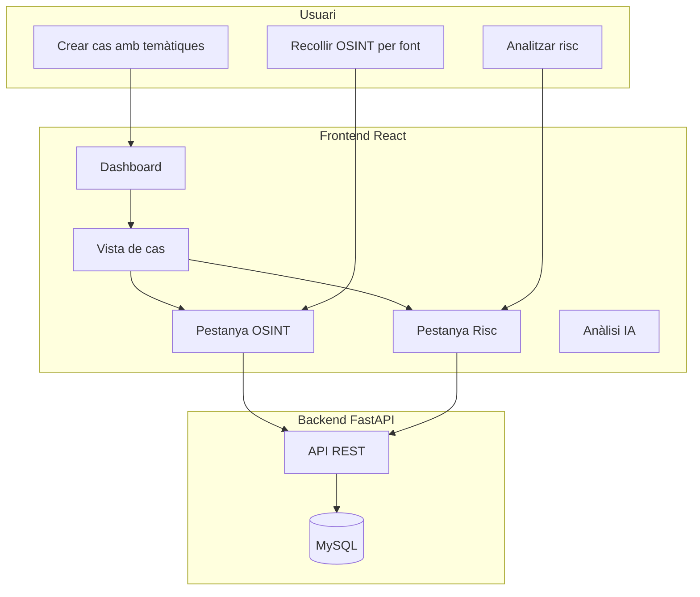
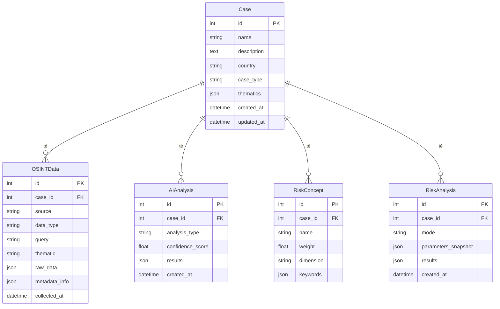

# Esquema de l'aplicació OSINT Platform

## Visió general

L'aplicació és una plataforma d'intel·ligència OSINT (Open Source Intelligence) que permet crear **casos**, recollir dades de fonts obertes, analitzar-les amb IA i calcular **risc per conceptes** (amb o sense IA).

---

## Flux principal

---

## Base de dades (MySQL)

---

## Què fa cada part

### 1. Cas (Case)

- **Què és**: Un projecte o investigació (ex: "Risc geopolític X", "Anàlisi marca Y").
- **Temàtiques**: Llista de temes (geopolitical, cyber, brand, person, market, other).
- **Flux**: L’usuari crea el cas al Dashboard → es desa a MySQL.

### 2. Recollida OSINT (OSINTData)

- **Què fa**: Recull dades de fonts obertes segons el tipus de font.
- **Fonts**: Sherlock (usuaris), Recon-ng (dominis), Google News, Reddit, GitHub, Whois, DNS, Wayback.
- **Temàtica**: Cada recollida es pot etiquetar amb una temàtica.
- **original_url**: Es normalitza per font i es desa a `metadata_info.original_url` per poder obrir la font original.
- **Flux**: L’usuari tria font + temàtica + consulta → Backend simula la recollida → es desa a MySQL.

### 3. Anàlisi IA (AIAnalysis)

- **Què fa**: Extreu conceptes i prediccions de les dades OSINT.
- **Flux**: L’usuari clica "Analitzar conceptes" → Backend genera conceptes i confiança → es desa a MySQL.

### 4. Conceptes de risc (RiskConcept)

- **Què fa**: Defineix conceptes a buscar (ex: "sancions", "conflicte") amb pes i dimensió.
- **Flux**: L’usuari afegeix conceptes a la pestanya Risc → es desen a MySQL.

### 5. Anàlisi de risc (RiskAnalysis)

- **Sense IA**: Cerca paraules clau als textos OSINT, compta coincidències i aplica pesos.
- **Amb IA**: Fa el mateix i afegeix reasoning (simulat).
- **Resultats**: Score per concepte, per dimensió i global.
- **Flux**: L’usuari clica "Analitzar sense IA" o "Analitzar amb IA" → Backend calcula → es desa a MySQL.

---

## API (endpoints principals)

| Mètode | Endpoint | Descripció |
|--------|----------|------------|
| GET | `/cases` | Llista casos |
| POST | `/cases` | Crear cas (amb thematics) |
| GET | `/cases/{id}/full` | Cas complet (OSINT, AI, risk) |
| GET | `/cases/filtered?thematic=X` | Casos filtrats per temàtica |
| POST | `/osint/collect` | Recollir OSINT (query, source_type, thematic) |
| POST | `/ai/analyze/{id}` | Anàlisi IA |
| GET | `/cases/{id}/risk-concepts` | Conceptes de risc |
| POST | `/cases/{id}/risk-concepts` | Afegir concepte |
| DELETE | `/cases/{id}/risk-concepts/{cid}` | Eliminar concepte |
| POST | `/risk/analyze/{id}` | Anàlisi risc sense IA |
| POST | `/risk/analyze-ai/{id}` | Anàlisi risc amb IA |

---

## Frontend (pestanyes)

| Pestanya | Funció |
|----------|--------|
| OSINT | Recollir dades (font, temàtica, consulta) + botó "Veure original" |
| Anàlisi IA | Analitzar conceptes i prediccions |
| Qualitatiu | KPIs i anàlisi qualitatiu |
| Inversió | Recomanacions d’inversió |
| Unificat | Anàlisi global |
| Risc | Configurar conceptes + Analitzar sense/amb IA |
